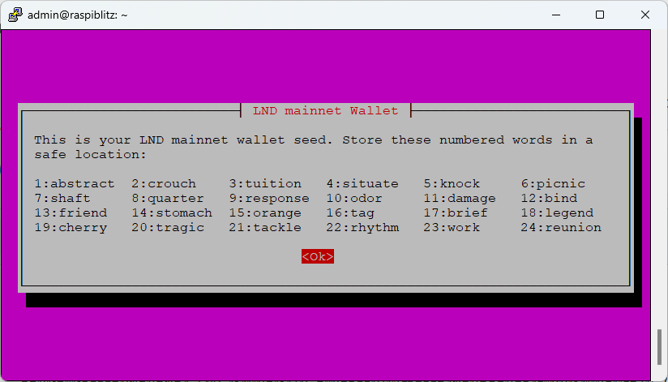
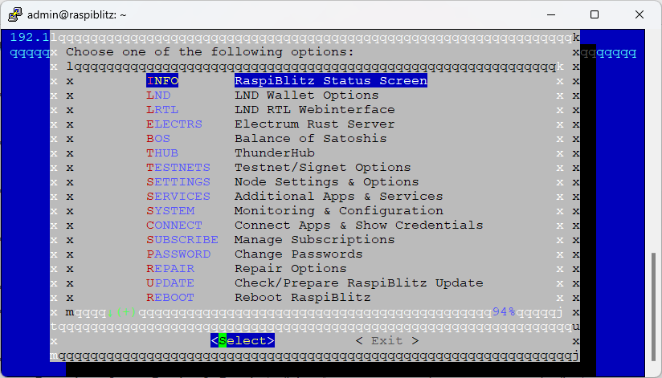

# วิธีล้าง LND Wallet และสร้าง LND Wallet ใหม่
  - เลือกเมนู REPAIR ใน Raspiblitz

 
  - เลือกเมนู REPAIR-LND

  - เลือกเมนู RESET-LND

 
  - ก่อนที่จะทำการลบข้อมูลของ LND ทั้งหมดทิ้งไป จะมีคำถามให้เราสำรองข้อมูลก่อนล้างระบบทั้งหมดหรือไม่ ในกรณีที่เราไม่ใช้ LND Node เก่าแล้วให้ตอบ Skip

  - Raspiblitz จะหยุด LND Service และกำหนดค่า Node Name ใหม่

  - ระบบถามยืนยันการลบ Node เดิมอีกรอบ

  - เมื่อลบข้อมูลทั้งหมดทิ้งพร้อมกับขึ้นหน้าต่างให้เรากำหนด Password C ของ LND Node ใหม่

  - เราจะได้รับ Seed ใหม่ จดใส่กระดาษให้เรียบร้อย

  - สุดท้ายเราจะได้ node ใหม่ ใช้ seed ใหม่เรียบร้อย และใส่ Password C ที่เราตั้งค่าใหม่เปิดเปิดใช้งาน LND Node ใหม่ได้เลยครับ

  
  
