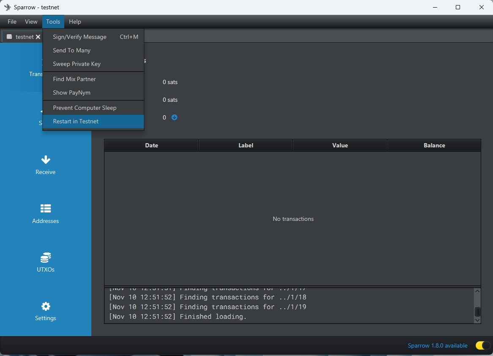
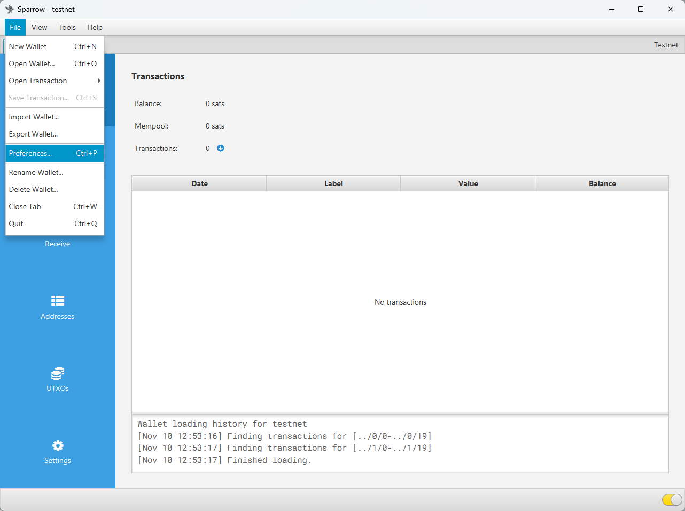
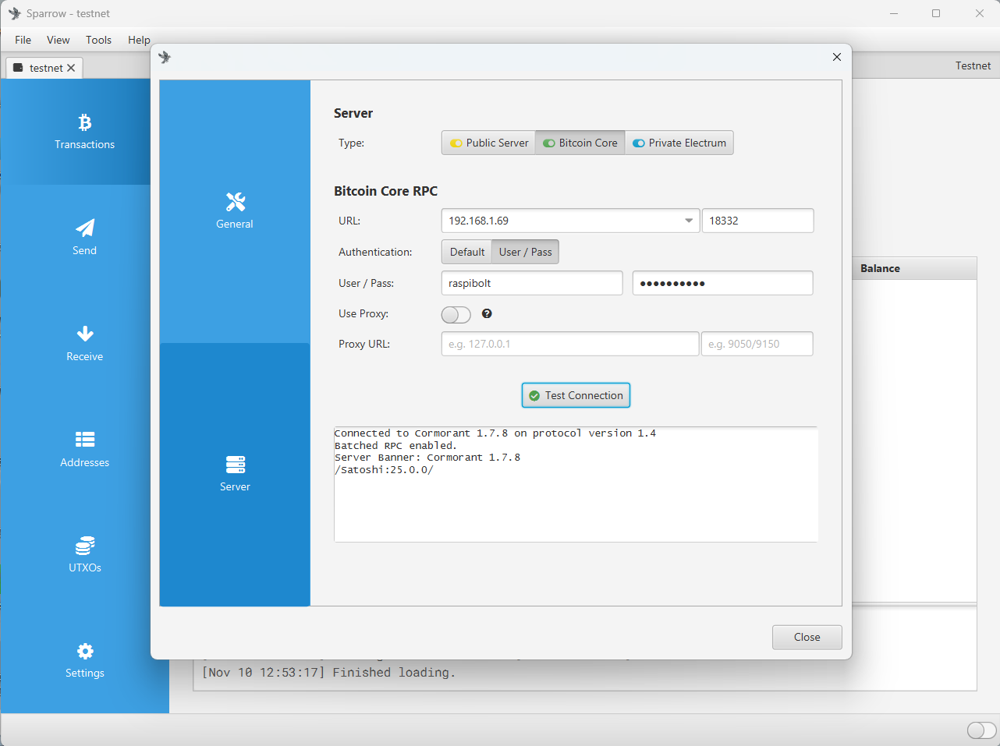

# Run Sparrow and LND in Testnet

https://github.com/teemie1/LNWorkshop/blob/main/Post-BTC2023_Workshop_Testnet.md

https://tinyurl.com/y94cvwbe

## ใช้ Sparrow Wallet ในโหมด Testnet
  - เลือกเมนู Tool --> Restart in Testnet

  - เข้าไปที่เมนู File --> Preferences

  - คลิ๊กที่ Server เลือก Server Type เป็น Bitcoin Core และใส่พารามิเตอร์ดังนีิ
    - URL : [NODE IP ADDRESS]
    - User/Pass: raspibolt / raspiblitz
    - คลิ๊ก "Test Connection" เมื่อเชื่อมต่อ Node สำหรับจะแสดงผลดังรูป

## Configure & Run Testnet LND
~~~
# Configure Testnet LND Environment
$ sudo -i
$ mkdir /mnt/hdd/lndtest
$ touch /mnt/hdd/lndtest/lndtest.conf
$ echo "raspiblitz" > /mnt/hdd/lndtest/password.txt
$ chown bitcoin.bitcoin -R /mnt/hdd/lndtest
$ exit

# Start Testnet LND Daemon
$ sudo -u bitcoin /usr/local/bin/lnd \
    --lnddir=/mnt/hdd/lndtest \
    --configfile=/mnt/hdd/lndtest/lndtest.conf \
    --wallet-unlock-password-file=/mnt/hdd/lndtest/password.txt \
    --wallet-unlock-allow-create \
    --listen=0.0.0.0:19735 \
    --rpclisten=0.0.0.0:11009 \
    --restlisten=0.0.0.0:18080 \
    --debuglevel=debug \
    --bitcoin.active \
    --bitcoin.testnet \
    --bitcoin.node=bitcoind \
    --bitcoind.rpcuser="raspibolt" \
    --bitcoind.rpcpass="raspiblitz" \
    --bitcoind.rpchost=192.168.1.69:18332 \
    --bitcoind.zmqpubrawblock=tcp://192.168.1.69:21332 \
    --bitcoind.zmqpubrawtx=tcp://192.168.1.69:21333 \
    --db.bolt.auto-compact \
    --tor.active \
    --tor.v3 \
    --tor.privatekeypath=/mnt/hdd/lndtest/tv3_onion_private_key \
    --tor.socks=9050 \
    --tor.control=9051 
~~~
Open another terminal window and create lnd testnet wallet
~~~
# Setting tlncli command for testnet LND
$ alias tlncli='sudo -u bitcoin /usr/local/bin/lncli -n=testnet --rpcserver 127.0.0.1:11009 --tlscertpath /mnt/hdd/lndtest/tls.cert --macaroonpath /mnt/hdd/lndtest/data/chain/bitcoin/testnet/admin.macaroon'
# Create new LND wallet
$ tlncli create
Input wallet password: raspiblitz
Confirm password: raspiblitz

Do you have an existing cipher seed mnemonic or extended master root key you want to use?
Enter 'y' to use an existing cipher seed mnemonic, 'x' to use an extended master root key
or 'n' to create a new seed (Enter y/x/n): n

Your cipher seed can optionally be encrypted.
Input your passphrase if you wish to encrypt it (or press enter to proceed without a cipher seed passphrase):

Generating fresh cipher seed...

!!!YOU MUST WRITE DOWN THIS SEED TO BE ABLE TO RESTORE THE WALLET!!!

---------------BEGIN LND CIPHER SEED---------------
 1. above    2. habit    3. profit   4. build
 5. palace   6. alert    7. subway   8. net
 9. power   10. oblige  11. orbit   12. nephew
13. trade   14. junk    15. hollow  16. repeat
17. rough   18. wrong   19. will    20. rice
21. lab     22. jaguar  23. web     24. move
---------------END LND CIPHER SEED-----------------

!!!YOU MUST WRITE DOWN THIS SEED TO BE ABLE TO RESTORE THE WALLET!!!

lnd successfully initialized!

	
# Verify Testnet LND daemon
$ tlncli getinfo

# Useful Testnet LND Command
$ tlncli newaddress p2wkh
$ tlncli walletbalance
$ tlncli connect 038863cf8ab91046230f561cd5b386cbff8309fa02e3f0c3ed161a3aeb64a643b9@203.132.94.196:9735
$ tlncli openchannel --sat_per_vbyte 8 038863cf8ab91046230f561cd5b386cbff8309fa02e3f0c3ed161a3aeb64a643b9 20000 0
$ tlncli listpeers
$ tlncli pendingchannels
$ tlncli listchannels
$ tlncli listpayments
~~~
